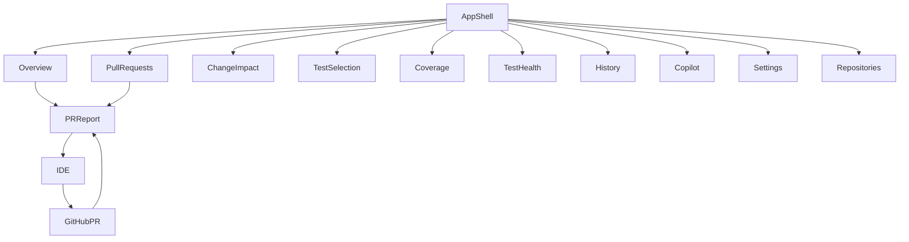
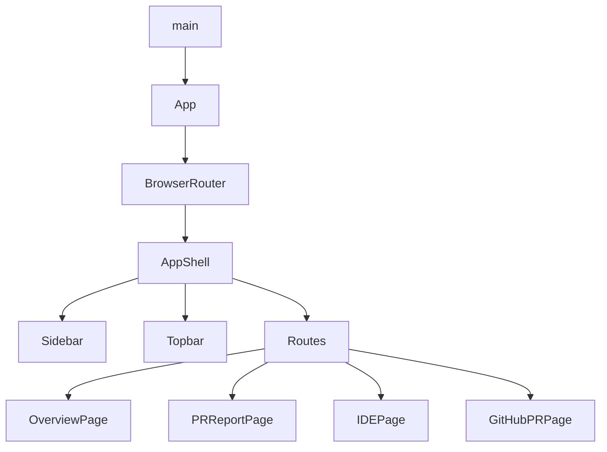
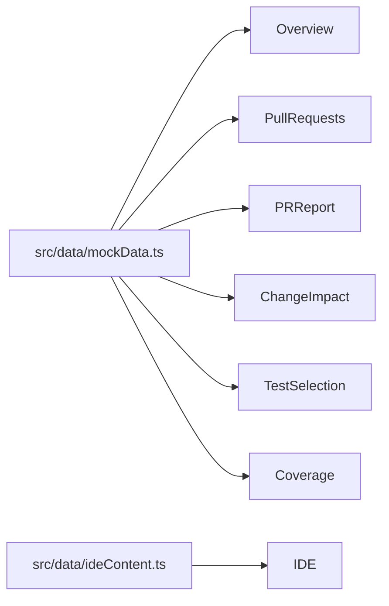

# Auracle Frontend Prototype - Current UI Context

## 1. Repository / Frontend Overview

The project is built using a modern React and Vite technology stack. There is no dedicated backend in this repository; it is entirely a high-fidelity frontend prototype driven by local mock data.

**Technology Stack:**
- **Framework**: Vite + React
- **React Version**: ^19.2.8
- **TypeScript**: ~6.0.2
- **Routing**: `react-router-dom` (^7.18.4)
- **Styling**: Vanilla CSS with custom properties for theming (`App.css`, `index.css`). It includes `clsx` and `tailwind-merge` but does not use TailwindCSS directly.
- **UI Components**: Radix UI primitives (`@radix-ui/react-dialog`, `react-select`, `react-slider`, `react-switch`, `react-tabs`, `react-tooltip`) and Lucide React for icons.
- **Charts**: `recharts` (^3.10.1)
- **State Management / Data Fetching**: Standard React state (`useState`, `useEffect`). No external data-fetching or state-management libraries (e.g., Redux, React Query) are present.

**Frontend Folder Structure:**
```text
src/
├── assets/      # Static assets
├── data/        # Contains local mock data simulating backend responses (`mockData.ts`, `ideContent.ts`)
├── pages/       # React components for each major route/screen
├── App.css      # Component-level styles
├── index.css    # Global variables, tokens, and utility classes
├── App.tsx      # Main application shell, sidebar, topbar, and router configuration
├── main.tsx     # React application entry point
```
*Note: The `src/components/` directory is notably absent, indicating a monolithic approach where UI elements are mostly built inline within the page components.*

---

## 2. Application Entry Point

The application starts in `src/main.tsx`, which imports global styles (`index.css`) and renders the `<App />` component wrapped in `<StrictMode>`.

The `<App />` component (in `src/App.tsx`) wraps the application in a `BrowserRouter` and renders `<AppShell />`.

`<AppShell />` manages the core layout conditionally:
- **Fullscreen Layout**: If the route starts with `/ide`, `/github`, or `/install-auracle`, it renders without the standard sidebar and topbar, simulating an immersive third-party environment (like an IDE or GitHub).
- **Standard Layout**: Renders the persistent `<aside className="sidebar">` and `<header className="topbar">`, along with a main content area containing the `<Routes>`.

**Rendering Hierarchy:**
```text
main.tsx
  ↓
App
  ↓
BrowserRouter
  ↓
AppShell
  ├── Sidebar (conditional)
  ├── Topbar (conditional)
  └── Routes (content area)
        ↓
      Page Component
```

---

## 3. Complete Route Inventory

| Route | Screen/Page | Component | Layout | Purpose |
|---|---|---|---|---|
| `/` | Overview | `Overview` | Standard | Dashboard summarizing repo status, stats, and active PRs. |
| `/repositories` | Repositories | `Repositories` | Standard | List of monitored repositories. |
| `/pull-requests` | Pull Requests | `PullRequests` | Standard | Table of active and recent pull requests. |
| `/pull-requests/184` | Pull Requests | `PullRequests` | Standard | Alias for PR list. |
| `/pull-requests/184/report` | PR Report | `PRReport` | Standard | Deep dive into a specific PR's analysis, tests, and coverage. |
| `/github/pr/184` | GitHub PR | `GitHubPR` | Fullscreen | Fake GitHub interface simulating the PR experience. |
| `/change-impact` | Change Impact | `ChangeImpact` | Standard | Graph and list view of code changes and their impact on tests. |
| `/test-selection` | Test Selection | `TestSelection` | Standard | Predictive test selection optimization controls and insights. |
| `/coverage` | Coverage | `Coverage` | Standard | Detailed analysis of changed-code coverage and material gaps. |
| `/test-health` | Test Health | `TestHealth` | Standard | Insights into flaky, slow, and frequently failing tests. |
| `/history` | History | `HistoryPage` | Standard | Historical trends of model quality, failure recall, and time saved. |
| `/copilot` | AI Copilot | `Copilot` | Standard | Chat interface for interrogating Auracle's evidence. |
| `/settings` | Settings | `SettingsPage` | Standard | Configuration for repo integration, policies, and AI providers. |
| `/install` | Setup | `Install` | Standard | Instructions for installing Auracle. |
| `/ide` | IDE View | `IDE` | Fullscreen | Fake VS Code interface simulating the developer experience. |
| `/install-auracle` | IDE View | `IDE` | Fullscreen | Alias for IDE view simulating installation flow. |

---

## 4. Navigation Architecture

**Sidebar Navigation**
The sidebar organizes the product into distinct conceptual areas:
- **Global**: Overview, Repositories, Pull Requests
- **Analysis**: Change Impact, Test Selection, Coverage
- **Intelligence**: Test Health, History, AI Copilot
- **System**: Settings (at the bottom)

**Topbar Navigation**
- **Repo Selector**: Displays the current repository (`acme/payments-api`).
- **Global Search**: Placeholder search input.
- **Status Indicator**: Shows ongoing analysis (`PR #184 analyzing`).
- **Quick Links**: "Setup" (`/install`) and "IDE View" (`/ide`).
- **Notifications**: Bell icon with a notification dot.

*Inference: The visual emphasis in the sidebar heavily groups "Analysis" and "Intelligence", indicating the product is fundamentally an analytical engine for developers rather than just a CI/CD executor.*

---

## 5. Screen-by-Screen Deep Analysis

### Screen: Overview
**Route**: `/`
**Source Files**: `src/pages/Overview.tsx`
**Apparent User Goal**: Get a high-level understanding of the repository's health, CI savings, and actionable active PRs.
**Product Message Conveyed**: Auracle saves significant time while maintaining perfect recall. It actively monitors PRs and flags those requiring attention.
**Layout Structure**:
- Header (Repo name, branch, "Start Journey" button)
- Summary Row (Time Saved, Recall, Avg Runtime cards)
- Main Panel (Active PRs list on the left, CI Runtime Trend chart and Health summary on the right)
**Primary Actions**:
- Action: Click "Start Journey" -> Result: Navigates to `/ide`.
- Action: Click PR #184 row -> Result: Navigates to `/pull-requests/184/report`.
**Current Assumptions Embedded**: Time saved and high recall (100%) are the primary value propositions.
**Current Screen Story**: The Overview screen tells the user that Auracle is actively saving them time on CI runs without missing bugs. It directs their attention to a specific failing PR (#184) that requires review.

### Screen: Pull Requests
**Route**: `/pull-requests`
**Source Files**: `src/pages/PullRequests.tsx`
**Apparent User Goal**: View the status of all active and historical PRs analyzed by Auracle.
**Layout Structure**: A single data table.
**Visible Information**: PR number, title, gate status (PASS/FAIL), risk level (HIGH/LOW), changed coverage, selected tests, runtime, and gaps.
**Primary Actions**:
- Action: Click PR #184 row -> Result: Navigates to `/pull-requests/184/report`.
**Current Screen Story**: Auracle acts as a quality gate for PRs, determining risk, selecting a subset of tests, and blocking merges if coverage gaps or test failures occur.

### Screen: PR Report
**Route**: `/pull-requests/184/report`
**Source Files**: `src/pages/PRReport.tsx`
**Apparent User Goal**: Understand exactly why Auracle blocked PR #184 and what needs to be fixed.
**Product Message Conveyed**: Auracle provides deep, evidence-based reasoning for its decisions, tracking the chain from code change to test failure and coverage gaps.
**Layout Structure**:
- Header (PR details, "Open in IDE to Fix" button)
- Gate Banner (Explains WHY the change is blocked)
- Core Metrics Row (8 small metric cards)
- Evidence Chain (Visual pipeline: CHANGE -> IMPACT -> SELECTION -> EXECUTION -> COVERAGE -> QUALITY GATE)
- Tabbed Content Area (Summary, Change, Impact, Tests, Coverage, Evidence, CI)
**Primary Actions**:
- Action: Click "Open in IDE to Fix" -> Result: Navigates to `/ide?step=2`.
- Action: Click Evidence Chain steps or Tabs -> Result: Changes URL search params `?tab=...` (Implementation of tab content is partially visible/inferred).
**Visual Hierarchy**: The red "GATE: FAIL" banner and the "WHY THIS CHANGE IS BLOCKED" section command the most attention.
**Current Screen Story**: The user is presented with a blocked PR. Auracle clearly articulates that the block is due to a failing test and an uncovered retry exhaustion branch, providing a verifiable evidence chain rather than a black-box decision.

### Screen: GitHub PR (Simulation)
**Route**: `/github/pr/184`
**Source Files**: `src/pages/GitHubPR.tsx`
**Apparent User Goal**: Experience how Auracle integrates directly into the GitHub PR UI.
**Product Message Conveyed**: Auracle operates seamlessly within existing developer workflows as a GitHub status check.
**Layout Structure**: Simulates the standard GitHub PR interface (Conversation, Commits, Checks, Files changed tabs).
**Visible Information**: Fake comments, commits, and a custom inline "Auracle Gate Report" panel summarizing changed files, selected tests, and gate failure reasons.
**Primary Actions**:
- Action: Click "Details" on the auracle check -> Result: Expands the inline Auracle Report.
- Action: Click "Open in Auracle Dashboard" -> Result: Navigates to `/pull-requests/184/report`.
**Current Screen Story**: The user sees Auracle injecting its intelligence directly into GitHub, blocking the merge and explaining the uncovered branch right where the developer already works.

### Screen: IDE (Simulation)
**Route**: `/ide` and `/install-auracle`
**Source Files**: `src/pages/IDE.tsx`
**Apparent User Goal**: Simulate the developer writing code, running tests, and interacting with the Auracle CLI locally.
**Layout Structure**: Fake VS Code interface with an Activity Bar, File Explorer, Code Editor, and an integrated Terminal at the bottom.
**Primary Actions**:
- Action: Type commands in the fake terminal (e.g., `git push`) -> Result: Simulates pushing code and navigates to the GitHub PR view.
**Data Used**: Fake file structure and file contents from `src/data/ideContent.ts`.
**Current Screen Story**: This screen acts as an interactive demo to show how a developer locally interacts with their code and how Auracle is installed and initialized via the CLI.

### Screen: Change Impact
**Route**: `/change-impact`
**Source Files**: `src/pages/ChangeImpact.tsx`
**Apparent User Goal**: Visualize the dependency graph between changed code and affected tests.
**Layout Structure**:
- Metrics Row
- View Toggle (Graph/List)
- Impact Map (Mermaid/SVG-based node graph)
- Node Inspector / TIA Signal Breakdown panel
**Current Screen Story**: Auracle understands the codebase deeply, mapping relationships between functions and tests to justify exactly why specific tests are selected.

### Screen: Test Selection
**Route**: `/test-selection`
**Source Files**: `src/pages/TestSelection.tsx`
**Apparent User Goal**: Configure how Auracle selects tests and understand the tradeoff between time saved and failure recall.
**Layout Structure**:
- Optimization Controls (Tabs for Confidence, Time, Percentage) with a slider.
- Selection Performance Curve Chart.
- Top Ranked Tests list.
**State Model**: The `mode`, `confidenceTarget`, and `timeBudget` state variables dynamically recalculate the `selectedCount`, `estimatedRuntime`, and `confidence` metrics displayed on the screen.
**Current Screen Story**: The user is in control. They can dial in their desired risk tolerance (e.g., 90% confidence), and Auracle will mathematically determine the optimal subset of tests to run.

### Screen: Coverage
**Route**: `/coverage`
**Source Files**: `src/pages/Coverage.tsx`
**Apparent User Goal**: Analyze coverage gaps specifically within the *changed* lines of code.
**Layout Structure**:
- Metrics Row
- Warning Banner
- Coverage Trend Chart & Source Code Viewer
- Changed File Coverage Table
**Current Assumptions Embedded**: "Changed-code coverage is the primary Auracle metric, not global repository coverage."
**Current Screen Story**: Auracle focuses the user on what matters—testing the new code. It highlights a "MATERIAL GAP" where a specific new branch has zero coverage.

### Screen: Test Health
**Route**: `/test-health`
**Source Files**: `src/pages/TestHealth.tsx`
**Apparent User Goal**: Identify problematic tests (flaky, slow, frequently failing).
**Layout Structure**: Metrics row, Tabs (Flaky, Slow, Frequently Failing, Rarely Failing), and a data table.
**Current Screen Story**: Auracle provides observability into the test suite's historical reliability, helping teams maintain a healthy test suite over time.

### Screen: History & Model Quality
**Route**: `/history`
**Source Files**: `src/pages/HistoryPage.tsx`
**Apparent User Goal**: Prove Auracle's value and reliability over time.
**Layout Structure**: Metrics row, Area charts for Runtime Savings and Failure Recall, and a table of recent PR changes.
**Current Screen Story**: The product builds trust by showing empirical data that it saves time without missing bugs, explicitly explaining "Shadow Mode" as a safe evaluation method.

### Screen: AI Copilot
**Route**: `/copilot`
**Source Files**: `src/pages/Copilot.tsx`
**Apparent User Goal**: Ask natural language questions about Auracle's analysis.
**Layout Structure**: Chat interface.
**Product Message Conveyed**: The AI is strictly "Evidence-Grounded". It does not hallucinate; it only explains the structured data Auracle produced.

### Screen: Settings
**Route**: `/settings`
**Source Files**: `src/pages/Settings.tsx`
**Apparent User Goal**: Configure repository integration, CI/CD settings, and AI privacy.
**Current Screen Story**: Emphasizes security and control, offering a "Local Ollama" AI provider option where "No source code leaves your environment."

### Screen: Setup / Install
**Route**: `/install`
**Source Files**: `src/pages/Install.tsx`
**Apparent User Goal**: Guide the user through integrating Auracle.
**Current Screen Story**: Auracle is incredibly easy to install. It requires "Minimal integration — no changes to your test code" and works with existing tools (pytest, GitHub Actions).

---

## 6. Complete Current User Journey

The prototype strongly implies a specific interactive demonstration flow:

**Step 1: Installation & Local Development (`/install-auracle` -> `/ide`)**
The user lands in the fake IDE. The terminal simulates installing Auracle (`pip install auracle`), initializing the repo, and pushing code.

**Step 2: The GitHub PR Experience (`/github/pr/184?step=0` -> `?step=1`)**
The user views the PR in GitHub. The standard CI passes, but the Auracle check fails. Expanding the Auracle details reveals that a new branch was uncovered.

**Step 3: Deep Dive in Auracle (`/pull-requests/184/report`)**
The user clicks "Open in Auracle Dashboard" and lands on the PR Report. They see the evidence chain and the exact lines of code missing coverage.

**Step 4: Fixing the Code (`/ide?step=2`)**
The user clicks "Open in IDE to Fix", returning to the IDE. The prototype simulates typing a new test to cover the gap. The user pushes the fix.

**Step 5: Successful Merge (`/github/pr/184?step=2`)**
Back in GitHub, all checks (including Auracle) now pass. The user clicks "Merge pull request" and the journey completes, returning them to the Overview dashboard.

---

## 7. Current Product Story Implied by the UI

**What does Auracle currently appear to be?**
Auracle appears to be an intelligent developer tool that acts as a predictive test selection engine and an advanced quality gate for CI/CD pipelines. It sits between code changes and test execution.

**What problem does the prototype currently appear to solve?**
It solves the problem of slow CI pipelines running thousands of unnecessary tests, while simultaneously solving the problem of developers merging code with missing test coverage for their specific changes.

**Apparent core product capabilities (by visual emphasis):**
1. **Predictive Test Selection**: Mathematically selecting only the tests impacted by a change to save time.
2. **Changed-Code Coverage Analysis**: Enforcing that new code is actually executed by the selected tests (identifying "Material Gaps").
3. **Evidence-Based Quality Gates**: Blocking PRs based on hard evidence, not black-box AI guesses.
4. **Test Health Observability**: Tracking flakiness and performance over time.
5. **AI Copilot**: An evidence-grounded chat interface to explain decisions.

**What appears to be the product's main output?**
- A **Gate Decision** (PASS/FAIL) on a Pull Request.
- A **subset of selected tests** to run.
- A **list of material coverage gaps** (uncovered changed branches).

**What is absent or barely represented?**
- Test *generation* (writing tests for the user) is absent; the AI only explains gaps, it doesn't fix them.
- Backend configuration or detailed user management is absent.

---

## 8. Terminology Inventory

| UI Term | Where Used | Apparent Meaning | Is Meaning Clear from UI? |
|---|---|---|---|
| **Quality Gate** | PR Report, GitHub PR | The final PASS/FAIL decision determining if a PR is safe to merge. | Yes |
| **Material Gap** | Coverage, PR Report | A changed code branch with zero validated coverage evidence after execution. | Yes (Explicitly defined in Coverage view) |
| **Shadow Mode** | Settings, Test Selection, History | Auracle runs its predictions alongside the full suite to measure accuracy without affecting CI. | Yes |
| **Failure Recall** | Overview, History, Test Selection | The percentage of actual test failures that Auracle correctly predicted and selected. | Yes |
| **Changed-Code Coverage** | Coverage, PR Report | The percentage of the *newly modified* lines/branches that are covered by tests. | Yes |
| **Evidence Chain** | PR Report | The traceable sequence of logic (Change -> Impact -> Selection -> Execution) justifying a decision. | Yes |

---

## 9. Metrics and Scores Inventory

| Metric | Screen | Source | How Calculated in Code | Real/Mock | Interpretation Presented to User |
|---|---|---|---|---|---|
| **Risk Score** | PR Report | `PR.risk` | Hardcoded ("HIGH") | Mock | Represents the danger of merging the PR (due to gaps/failures). |
| **Confidence Target** | Test Selection | Local State | Range slider (70-99%) | Mock | User's desired probability of catching failures. |
| **Time Saved** | Overview | `REPO.stats.runtimeSaved` | Hardcoded ("81%") | Mock | CI execution time avoided by not running the full suite. |
| **Changed Coverage** | Coverage | `CHANGE_SUMMARY.changedCodeCoverage` | Hardcoded ("88%") | Mock | How much of the PR's code is tested. |

---

## 10. Data Model Implied by the Frontend

The domain entities are explicitly defined in `src/data/mockData.ts`:

- **`REPO`**: Represents a repository (e.g., id, name, defaultBranch, framework, coverage, stats).
- **`PR`**: Represents a pull request (e.g., number, branch, commit, author, gate, risk).
- **`CHANGE_SUMMARY`**: Aggregated metrics for a PR (filesChanged, functionsAffected, selectedTests, changedCodeCoverage, materialGaps).
- **`CHANGED_FILES`**: Details of modified files (path, added/deleted lines, changedSymbols, diff snippets).
- **`SELECTED_TESTS`**: List of tests evaluated (name, duration, impactScore, selected boolean, result).
- **`COVERAGE_LINES`**: Line-by-line coverage data for the source code viewer.
- **`IMPACT_GRAPH_NODES` / `EDGES`**: Graph data for the Change Impact map.

---

## 11. Mock Data and Hard-Coded Product Assumptions

All data is housed in `src/data/mockData.ts` and `src/data/ideContent.ts`.
- **Primary Assumption**: The entire prototype is hardcoded to tell the story of a single repository (`acme/payments-api`) and a single pull request (`PR #184: Add guarded retry to refund processing`).
- **Coherent Scenario**: The mock data is highly coherent across screens. The `CHANGED_FILES` diffs match the `COVERAGE_LINES` missing coverage, which matches the `SELECTED_TESTS` failure, which matches the explanations given by the `Copilot`.

---

## 12. Component Architecture

| Component Type | File | Responsibility |
|---|---|---|
| **Cards (`.card`)** | `App.css` | Used globally to contain panels, metrics, and tables. |
| **Badges (`.badge`)** | `App.css` | Used to display PASS/FAIL, HIGH/LOW risk, and status labels. |
| **Data Tables** | Various | Custom HTML tables styled with `.data-table` for PRs and Test Health. |
| **Terminal** | `Install.tsx`, `IDE.tsx` | Simulates a command-line interface. |
| **Code Viewer** | `Coverage.tsx` | Displays syntax-highlighted (simulated) code with coverage gutters. |

*Constraint: Components are not modularized into a `src/components/` folder. They are built inline within the page files, relying on global CSS classes.*

---

## 13. Design System / Visual Language

- **Visual Character**: High-end enterprise developer tool. Dark mode by default.
- **Colors**: Deep dark backgrounds (`#0d1117`, `#080a0f`), subtle borders, with vibrant semantic colors (Green `#2dd98a` for PASS/Success, Red `#f85149` for FAIL/Errors, Blue/Purple for AI/Selection).
- **Typography**: Uses system fonts (`-apple-system`, `Inter` implied) and monospace fonts (`var(--font-mono)`) heavily for code and metrics.
- **Aesthetic Inference**: The UI deliberately mimics the aesthetics of GitHub, VS Code, and modern observability tools (like Datadog or Linear) to feel familiar and trustworthy to engineers.

---

## 14. Screen Relationship Map



---

## 15. Component Hierarchy Diagram



---

## 16. Data Flow Diagram



---

## 17. Current Prototype Strengths

- **Coherent Narrative**: The data across the Change Impact graph, Coverage viewer, and Gate banner perfectly aligns to tell a believable story about a missing test for a retry loop.
- **Evidence-Based Positioning**: By constantly surfacing the "Evidence Chain" and explicitly stating the AI is not hallucinating, the UI effectively counters developer skepticism toward AI tools.
- **Immersive Demo**: The fake IDE and fake GitHub screens provide exceptional context for how the product actually feels to use in a real workflow.

---

## 18. Current Prototype Weaknesses / Ambiguities

- **Monolithic Components**: The lack of a `src/components` directory means UI elements (like cards, metric blocks, and tabs) are copy-pasted across pages.
- **Navigation Overload**: The sidebar implies a massive product surface area (Change Impact, Test Selection, Coverage, Test Health), but it's unclear if a user would actually visit all these tabs daily, or if they only care about the single PR Report page.
- **Static Interactions**: Sliders on the `TestSelection` page visually update numbers, but do not affect the mock data on other pages.

---

## 19. Existing Features That Appear Incomplete

- **Search Bar**: The topbar search input `placeholder="Search tests, files, PRs..."` has no event handlers.
- **Notifications**: The bell icon in the topbar is purely decorative.
- **GitHub PR Tabs**: On the GitHub simulation page, the "Checks" and "Files changed" tabs show "placeholder" text.

---

## 20. Technical Constraints Relevant to Future UI Changes

- **Global CSS Reliance**: Changing the design system requires modifying `index.css` and `App.css` directly; there are no Tailwind utility classes or styled-components to manage scope.
- **Hardcoded Data Coupling**: Pages map directly to the specific shape of objects in `mockData.ts`. Swapping to a real API will require significant refactoring of how pages consume data.
- **Fullscreen Layout Toggles**: The `AppShell` uses `location.pathname.startsWith(...)` to determine whether to hide the sidebar. Adding new immersive routes requires updating this hardcoded logic.

---

## 21. Screen Inventory Summary

| Screen | Route | Primary Purpose | Main Data | Main Action | Current Product Concept Represented |
|---|---|---|---|---|---|
| Overview | `/` | Repo health summary | `REPO.stats` | Click PR | Time saved + Active monitoring |
| PR Report | `/pull-requests/184/report` | Explain PR block | `CHANGE_SUMMARY`, `COVERAGE_LINES` | Open IDE | Evidence-based quality gate |
| GitHub PR | `/github/pr/184` | Workflow simulation | Hardcoded states | Merge PR / Details | Seamless workflow integration |
| IDE | `/ide` | Developer simulation | `ideContent.ts` | Type commands | Developer environment |
| Test Selection | `/test-selection` | Optimization tuning | Local State, `SELECTED_TESTS` | Adjust slider | User-controlled risk tradeoff |
| Coverage | `/coverage` | Identify gaps | `COVERAGE_LINES` | Read gap | Focus on changed code |
| History | `/history` | Prove value | `HISTORY_DATA` | Read charts | Trust via shadow mode |

---

## 22. User-Flow Summary

| Flow | Starting Screen | Intermediate Screens | Final Outcome | What User Learns/Does |
|---|---|---|---|---|
| Initial Demo | `/install-auracle` (IDE) | GitHub PR -> PR Report | IDE (Fix) -> GitHub (Merge) | Learns how Auracle catches a missing test and integrates into their workflow. |
| Analytics Review | `/` (Overview) | History -> Test Health | N/A | Reviews the long-term ROI and health of the test suite. |

---

## 23. Current Product Narrative in Plain English

Auracle presents itself as a next-generation, AI-assisted quality gate and test intelligence platform for developers. When a user first approaches the product, they are promised massive CI time savings without the risk of missing bugs. 

The primary workflow is entirely automated in the background. A developer writes code and pushes a Pull Request. Auracle analyzes the diff, maps the impact across the codebase, and mathematically selects only the relevant tests to run. If the selected tests pass, and there are no "material gaps" (uncovered new code), Auracle allows the PR to merge.

However, if a test fails or a gap is found, Auracle blocks the PR. The user is then brought into the Auracle Dashboard (the PR Report screen). Here, the product does not just say "Fail"—it meticulously lays out its evidence. It shows the exact lines of changed code, the tests it selected, and highlights exactly where the coverage gap exists. 

The product heavily emphasizes trust. It explicitly defines "Shadow Mode" to prove it works before being put in the critical path. It features an AI Copilot that is strictly constrained to explaining the evidence, preventing hallucinations. Ultimately, Auracle aims to be viewed not as a black-box AI, but as a transparent, mathematically sound co-worker that protects the main branch while speeding up development.

---

## 24. Code Evidence Index

- **Routing & Layout**: `src/App.tsx`, `src/main.tsx`
- **Global Styles**: `src/index.css`, `src/App.css`
- **Mock Data**: `src/data/mockData.ts`, `src/data/ideContent.ts`
- **PR Report Page**: `src/pages/PRReport.tsx`
- **IDE Simulation**: `src/pages/IDE.tsx`
- **GitHub Simulation**: `src/pages/GitHubPR.tsx`
- **Test Selection**: `src/pages/TestSelection.tsx`
- **Coverage**: `src/pages/Coverage.tsx`

---

## 25. Important Unknowns

- **Backend Architecture**: There is no hint of how the backend (the actual AST parser, impact graph generator, or ML model) communicates with the frontend. The data structures might change significantly when connected to a real API.
- **Multi-Repo Support**: While a "Repositories" list exists, it's unclear how the UI handles context switching between entirely different codebases with different languages or test frameworks.
- **Real-Time Updates**: It is unknown how the UI will handle real-time CI status updates (WebSockets vs. Polling), as the current prototype relies on hardcoded click-to-advance simulations.
